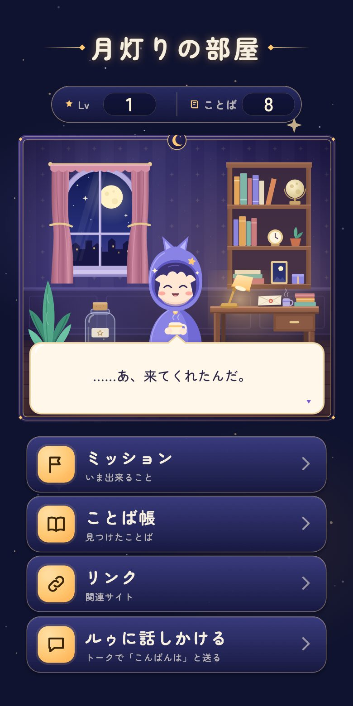
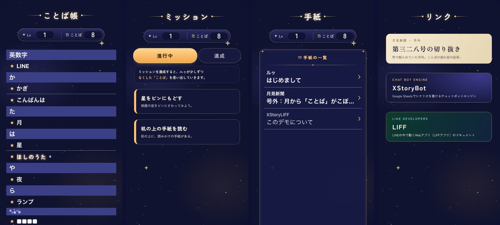

# XStoryLIFF

LINEのトークで進む物語に、キャラクターの住む「部屋」や、集めたことばの一覧などの画面を添える、LIFFアプリのエンジンです。[XStoryBot](https://github.com/alt-core/XStoryBot)と組み合わせると、トークとLIFFで同じ利用者の進行（フラグ）を共有できます。

<p align="center"></p>

## できること

- **Room**: 物（オブジェクト）の画像を重ねて部屋を描きます。Botから届く台本で、台詞、物の置き換え、演出（光る・弾む・揺れる・部屋全体が光る）を順に見せます。物をタップすると台本が動きます。物を決まった場所へ運ぶ謎（condition）も作れます
- **メニュー**: Roomの下に並ぶ、画像のボタンです。どれを出すかはBotが決め、台本の途中で演出付きで出すこともできます
- **ステータス表示**: Lvとことばの数を、画像の上に重ねて表示します
- **ことば帳**: トークで見つけたことばを、読み順に見出しを付けて並べます。タップすると、そのことばをトークへ送ります
- **ミッション**: 進行中と達成済みのタブがあります
- **手紙**: 未読・既読の区別があり、本文はHTMLで書けます。開いた時に台本を動かせます（onopen）
- **リンク集**: イベントの間だけ、バナーを差し替えられます
- **資料**: 作中の資料の画像を表示します。グリッチの演出を2段階の強さで重ねられ、URLで切り替えられます
- **作品固有のページ**: 謎解きの画面などをSvelteで足せます。台詞の吹き出しを置けば、そのページでも台詞を出せます
- **LINEとXStoryBotのWebchat**: 同じ画面とシナリオを、LINEのLIFFでも、XStoryBotのWebchat（チャットの中のiframe）でも使えます
- **作品ごとのフォルダ**: 作品の設定・画像・ページ・モックを `projects/<名前>/` にまとめます。デモとは別のフォルダなので、フォークしてエンジンの更新を取り込みやすくなっています



## しくみ

```text
LINEのトーク ──(メッセージ)──┐
                              ├─ XStoryBot ─ 利用者の進行（フラグ）
XStoryLIFF ──(LIFF の action)─┘      │
    ▲                                │ シナリオ（Google Sheets など）
    └──── 台詞・コマンド・状態のJSON ─┘ ##liff.<action> に応答を書く
```

XStoryLIFFは、XStoryBotのLIFFの取り決めに従って、`get_status` などのactionを送ります。LINEではXStoryBotのLIFF API（`/liff/<Bot名>/message`）へ、XStoryBotのWebchatではWebchatの画面へ送ります。返ってきた行を、表示や演出に使います。応答の中身は、シナリオに `##liff.<action>` という条件で書きます。LIFFとトークは同じ利用者として扱われるので、トークで見つけたことばが、そのままことば帳に並びます。

やり取りの詳細は[Botとの連携仕様](protocol.md)を参照してください。

## はじめる（LINEなしのデモ）

Node.js 22.18以降を用意します。

```sh
npm install
npm run dev:mock
```

`http://127.0.0.1:5173/` を開くと、デモ作品「月灯りの部屋」（`projects/demo/`）がブラウザーの中だけで動きます。LINEとBotの代わりにデモのモック（`projects/demo/mock.ts`）が応答し、トークへの送信は画面下のお知らせで表示します。URLに `?reset` を付けると最初から、`?event=intro` を付けると登場イベントをもう一度見られます。

## LINEとXStoryBotにつなぐ

1. LINE DevelopersでLIFFアプリを作ります。Botと同じプロバイダーのLINEログインチャネルに作り、サイズは `Full`、scopeは `profile` と `chat_message.write` にします。
2. XStoryBotの設定で、Botの `interfaces` に `liff` を加えます。`plugins.liff` には、この画面を置くorigin（`allow_origin`）と、LIFFアプリを作ったLINEログインチャネルのID（`login_channel_id`）を書きます。
3. `.env.example` を `.env.local` へコピーし、LIFF ID、XStoryBotのAPIの基点、Bot名を書きます。
4. シナリオに `##liff.get_status` などを書きます。[サンプルシナリオ](../../projects/demo/xstorybot/)は、デモと同じ動きをXStoryBotで再現します。
5. `npm run build` で `dist/` を作り、静的ホストへ置きます。

手順の詳細は[公開手順](deployment.md)にあります。XStoryBotのWebchatでも使う時は、[公開手順の「XStoryBotのWebchatで使う」](deployment.md#xstorybotのwebchatで使う)を参照してください。

## 自分の作品を作る

作品は `projects/<名前>/` のフォルダにまとめます。自分の作品は、同梱のデモ（`projects/demo/`）とは別のフォルダに作り、エンジン（`src/`）とデモには手を入れません。こうしておくと、このリポジトリをフォークしても、エンジンの更新を取り込みやすくなります（[開発と動作確認](development.md#エンジンの更新を取り込む)）。

1. デモのフォルダを複製します（`cp -R projects/demo projects/mystory`）。
2. リポジトリの直下に `.env` を作り、`XSTORYLIFF_PROJECT=mystory` と書きます。`npm run dev` やビルドは、この作品を使います。`.env` はコミットしてかまいません。
3. 作品のフォルダの中身を、自分の作品に書き換えます。

| 場所 | 内容 |
|---|---|
| `config.ts` | 作品名、書体、ページのタイトル、メニュー、リンク集、資料、画像の置き場所 |
| `skin.css` | 背景色、ステータス表示の数値の位置と書体、台詞の文字色などのCSS変数 |
| `public/skin/` | 画面を作る画像（見出し、ボタン、額縁、吹き出しなど） |
| `public/data/` | Botのデータが指す画像（部屋の物、ことば、ミッション、資料） |
| `pages/` | 作品固有のページ（任意） |
| `setup.ts` | 全ページで使うコマンドなど（任意） |
| `mock.ts` | LINEなしで確かめるためのモック（任意） |
| `xstorybot/` | XStoryBotのシナリオ（任意。Google Sheetsに書く場合は不要） |

`.env` とは別の作品を開く時は、`XSTORYLIFF_PROJECT=demo npm run dev:mock` のように、起動する時に選べます。

作品の説明は、リポジトリの直下の `README.md` と、`docs/` の直下に書けます。エンジンの説明は、この `docs/xstoryliff/` にまとめてあり、直下の `README.md` は短い案内だけにしてあるので、作品の説明に書き換えてかまいません。

## ドキュメント

- [Botとの連携仕様](protocol.md)
- [台本のコマンド](commands.md)
- [作品に合わせた設定と拡張](customization.md)
- [開発と動作確認](development.md)
- [公開手順](deployment.md)
- [サンプルシナリオ](../../projects/demo/xstorybot/README.md)

## 開発

```sh
npm test            # 単体テスト
npm run check       # 型検査
npm run build       # 公開用のビルド（LINEかWebchatの設定が必要。公開手順を参照）
npm run build:mock  # LINEなしで動くビルド（作品のモックが応答する）
```

## ライセンス

XStoryLIFF本体と、特記のない同梱素材には[MIT License](../../LICENSE)を適用します。

- [画像の権利情報](../../ASSET_CREDITS.md)
- [外部ソフトウェアの権利表示](../../THIRD_PARTY_NOTICES.md)
